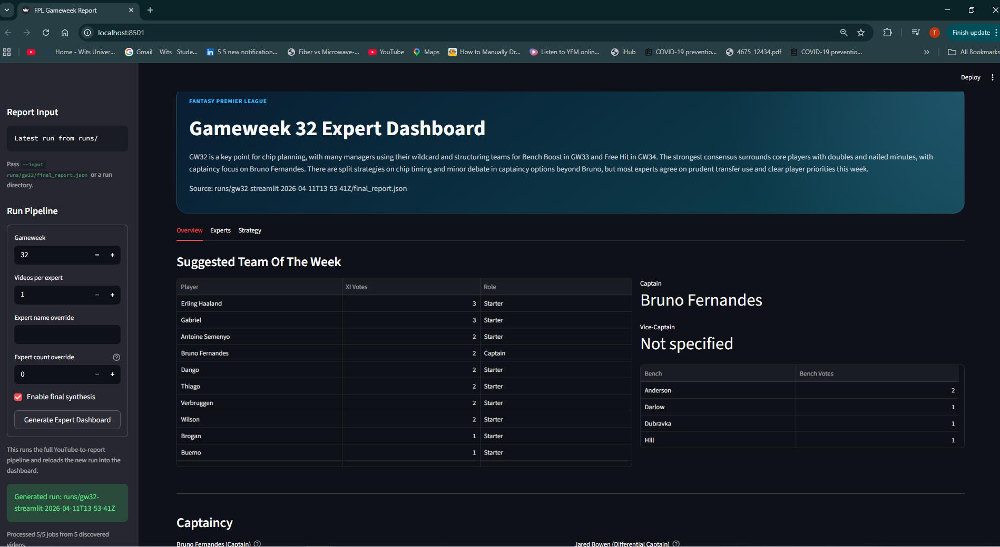

# ⚽ FPL Technocrat

[](https://www.python.org/downloads/)
[](https://streamlit.io/)
[](https://openai.github.io/openai-agents-python/)
[](https://www.docker.com/)
[](https://docs.astral.sh/uv/)

AI-powered Fantasy Premier League workflow that converts expert YouTube videos into structured gameweek intelligence, reviewable artifacts, and a dashboard-ready report.

## Dashboard Preview


## 🚀 Features
- 📺 Auto-fetch recent FPL YouTube videos from configured expert channels
- 🧠 Run LLM-based transcript analysis into typed, structured outputs
- 📊 Detect consensus, disagreement, captaincy, transfers, and team-reveal patterns
- 📝 Generate markdown and JSON gameweek reports under `runs/`
- 📈 Explore results in a Streamlit dashboard and launch runs from the UI
- 🐳 Run locally with `uv` or in Docker

## 🧠 Why This Matters
FPL content is high-volume and repetitive. Useful signals are buried across multiple creators, long videos, and slightly different phrasing.

FPL Technocrat turns that into a repeatable weekly workflow:
- ingest expert content automatically
- normalize it into structured analysis
- compare experts at scale
- surface agreement, disagreement, and team-reveal signals
- produce outputs you can inspect, reuse, or visualize

## What This Repository Actually Does
This repository is not just a dashboard and not just an LLM wrapper.

It is an end-to-end gameweek reporting pipeline that:
- discovers recent YouTube videos from configured FPL experts
- fetches and caches transcripts
- builds `VideoAnalysisJob` inputs per relevant video
- runs expert-analysis agents over each transcript
- aggregates the results into consensus and disagreement views
- writes a complete run folder with JSON artifacts and `report.md`
- loads the final report into a Streamlit UI for inspection

## Architecture At A Glance
```text
Configured expert channels
    ↓
Discover latest videos
    ↓
Filter relevant videos
    ↓
Fetch transcripts
    ↓
Build VideoAnalysisJobs
    ↓
Run expert analysis agents
    ↓
Aggregate consensus + disagreements
    ↓
Persist artifacts under runs/
    ↓
Review in Streamlit dashboard
```

## Outputs
Each run produces reviewable artifacts under `runs/<gameweek-or-run-name>/`.

Core outputs:
- `discovered_videos.json`: normalized metadata for candidate videos discovered from expert channels
- `input_jobs.json`: validated transcript-backed jobs sent into analysis
- `expert_outputs.json`: structured per-expert analysis output
- `aggregate_report.json`: deterministic consensus and disagreement data
- `final_report.json`: final report consumed by the UI
- `report.md`: human-readable gameweek report
- `manifest.json`: run metadata, counts, duplicate handling, and failures

This makes the project useful both as an automation tool and as an inspectable data pipeline.

## Quick Start
```bash
cp .env.example .env
make install
make test
make run-ui
```

Open the Streamlit app at `http://localhost:8501`.

## Prerequisites
- Python `3.12`
- [`uv`](https://docs.astral.sh/uv/)
- Docker Desktop or Docker Engine if you want the container workflow

## Environment Variables
Copy `.env.example` to `.env` and fill in the values you need.

| Variable | Required | Purpose |
| --- | --- | --- |
| `OPENAI_API_KEY` | Usually yes | Credentials for the `openai-agents` runtime used during expert analysis and final synthesis |
| `OPENAI_BASE_URL` | Optional | Base URL for an OpenAI-compatible provider |
| `OPENAI_DEFAULT_MODEL` | Optional | Default model used when creating provider-aware agent models |
| `ENABLE_WEBSHARE_PROXY` | Optional | Set to `true` to route transcript fetches through Webshare |
| `WEBSHARE_PROXY_USERNAME` | If proxy enabled | Webshare username |
| `WEBSHARE_PROXY_PASSWORD` | If proxy enabled | Webshare password |

`--no-synthesis` only skips the final LLM synthesis step. The pipeline still uses `openai-agents` earlier to analyze video transcripts, so full pipeline runs still need provider credentials.

The analysis and synthesis agents use a shared OpenAI-compatible model factory. To target providers such as Ollama Cloud, set `OPENAI_BASE_URL` and `OPENAI_DEFAULT_MODEL` to the values from your provider.

## Local Development
Install dependencies:

```bash
make install
```

Run the full test suite:

```bash
make test
```

Run lint checks:

```bash
make lint
```

## Main Execution Paths
### CLI Pipeline
Source of truth command:

```bash
uv run python -m app.main --gameweek 32 --output-dir runs/gw32-example --per-expert-limit 2 --no-synthesis
```

Equivalent Make target:

```bash
make run-cli GAMEWEEK=32 OUTPUT_DIR=runs/gw32-example
```

Useful overrides:
- `PER_EXPERT_LIMIT=3`
- `EXPERT_NAME="FPL Focal"`
- `EXPERT_COUNT=5`
- `SYNTHESIS=1`

What the CLI does:
- loads environment and proxy settings
- ingests recent expert videos
- orchestrates transcript analysis jobs
- writes run artifacts to the output directory
- prints a human-readable report location when complete

### Streamlit Dashboard
Source of truth command:

```bash
uv run streamlit run app/ui/streamlit_app.py --server.address 0.0.0.0 --server.port 8501
```

Equivalent Make target:

```bash
make run-ui
```

To load a specific run folder or artifact:

```bash
uv run streamlit run app/ui/streamlit_app.py --server.address 0.0.0.0 --server.port 8501 -- --input runs/gw32
make run-ui INPUT=runs/gw32
```

The UI can also launch a fresh pipeline run from the sidebar and reload the resulting report into the same session.

### Test Suite
Source of truth command:

```bash
uv run pytest
```

Equivalent Make target:

```bash
make test
```

## Docker Workflow
Build the image:

```bash
make docker-build
```

Run the Streamlit UI in Docker:

```bash
make docker-run
```

Then open `http://localhost:8501`.

Notes:
- `docker-compose.yml` is included because it makes local UI startup, `.env` loading, and persistent `runs/` and `data/` directories much easier for contributors.
- The container mounts `./runs` and `./data` into `/app/runs` and `/app/data`, so generated artifacts stay on your host machine.
- If you prefer plain Docker for the CLI, you can override the container command:

```bash
docker run --rm -it --env-file .env \
  -v "$(pwd)/runs:/app/runs" \
  -v "$(pwd)/data:/app/data" \
  fpl-agent:latest \
  uv run python -m app.main --gameweek 32 --output-dir runs/gw32-docker --per-expert-limit 2 --no-synthesis
```

Stop the Compose service with:

```bash
make docker-down
```

## Weekly Workflow
1. Update `.env` if provider credentials or proxy settings changed.
2. Run the weekly pipeline with `make run-cli GAMEWEEK=<n> OUTPUT_DIR=runs/gw<n>`.
3. Review `runs/gw<n>/report.md` and the corresponding JSON artifacts.
4. Open the dashboard with `make run-ui INPUT=runs/gw<n>` for visual review.
5. Re-run with different filters if you want to limit experts or compare outputs.

## Troubleshooting
- `Pipeline could not create any usable video analysis jobs from YouTube sources`: discovery returned no relevant videos, or no usable transcript could be fetched.
- `Pipeline did not produce any expert analyses`: every job failed or had an unusable transcript.
- Webshare errors: if `ENABLE_WEBSHARE_PROXY=true`, both proxy credentials must be set.
- Transcript fetch errors are retried with bounded backoff before being recorded in `manifest.json`.
- Successful transcripts are cached under `data/transcripts/`.

## Key Code Paths
- CLI entry: [app/cli/run_gameweek_report.py](/home/l/projects/fpl_agent/app/cli/run_gameweek_report.py)
- Streamlit app: [app/ui/streamlit_app.py](/home/l/projects/fpl_agent/app/ui/streamlit_app.py)
- Streamlit-triggered pipeline runs: [app/ui/pipeline_runner.py](/home/l/projects/fpl_agent/app/ui/pipeline_runner.py)
- Pipeline orchestration: [src/services/pipeline_service.py](/home/l/projects/fpl_agent/src/services/pipeline_service.py)
- Expert transcript analysis: [src/services/expert_analysis_service.py](/home/l/projects/fpl_agent/src/services/expert_analysis_service.py)
- YouTube ingestion: [src/services/transcript_ingestion_service.py](/home/l/projects/fpl_agent/src/services/transcript_ingestion_service.py)
- Aggregation and consensus: [src/services/aggregation_service.py](/home/l/projects/fpl_agent/src/services/aggregation_service.py)
- Final synthesis and fallback report generation: [src/services/synthesis_service.py](/home/l/projects/fpl_agent/src/services/synthesis_service.py)
